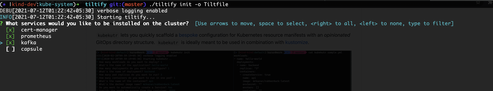

# tiltify

🍪✂️ Deploy your Kubernetes cluster easily with tilt.

`tiltify` lets you quickly scaffold a Tilt configurationfile for Kubernetes resource manifests. 



## Motivation

`tiltify` is a simple tool to create an easy k8s development environment using tilt. You can easily setup a test cluster based on configurations that match your production workloads. This would make it easy for developers to easily setup a production like cluster locally.

## Installation

### Grab the latest binary

```shell
$ cd "$(mktemp -d)"
$ curl -sL "https://github.com/arriqaaq/tiltify/releases/download/0.8.2/tiltify_0.1.0_$(uname)_amd64.tar.gz" | tar xz
$ mv tiltify /usr/local/bin
# tiltify should be available now in your $PATH
$ tiltify --version
```

## Usage

```shell
NAME:
   tiltify 

USAGE:
   tiltify [global options] command [command options] [arguments...]


COMMANDS:
   init, i      Initialize a new project.
   help, h      Shows a list of commands or help for one command

GLOBAL OPTIONS:
   --verbose                 Enable verbose logging
   --help, -h                show help
   --version, -v             print the version
```

### Initialise a new project

- **Using Prompt**

`tiltify init -o <filename.yml>`


- **Using default config**

`tiltify init --default`

Either of these options create a config file `tiltify.yml` in your current working directory. You can edit this file further to suit your needs and scaffold a project using this.
