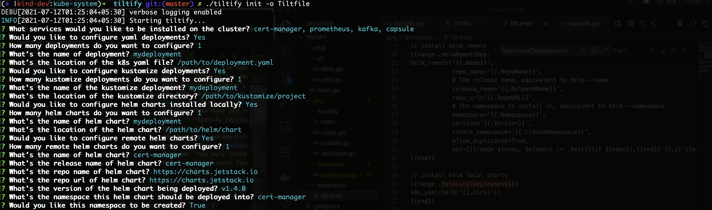

# tiltify

Deploy your Kubernetes cluster easily with tilt.

`tiltify` lets you quickly scaffold a [Tilt](https://github.com/tilt-dev/tilt) configuration file. 


## Motivation

`tiltify` is a simple tool to create an easy k8s development environment using [tilt](https://github.com/tilt-dev/tilt). You can easily setup a test cluster based on configurations that match your production workloads. This would make it easy for developers to easily setup a local mock of the production cluster.

## Installation


### Grab the latest binary

```shell
$ cd "$(mktemp -d)"
$ curl -sL "https://github.com/arriqaaq/tiltify/releases/download/v0.1.0/tiltify_0.1.0_$(uname)_amd64.tar.gz" | tar xz
$ mv tiltify /usr/local/bin
# tiltify should be available now in your $PATH
$ tiltify --version
```

## Usage

```shell
NAME:
   tiltify 

USAGE:
   tiltify [global options] command [command options] [arguments...]


COMMANDS:
   init, i      Initialize a new TiltFile.
   help, h      Shows a list of commands or help for one command

GLOBAL OPTIONS:
   --verbose                 Enable verbose logging
   --help, -h                show help
   --version, -v             print the version
```

### Initialise a new Tiltfile

- **Using Prompt**

`tiltify init -o <filename.yml>`


